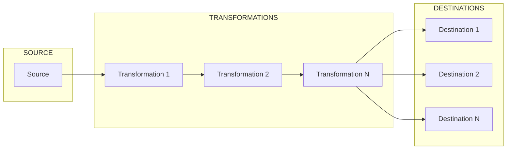

# SimplETL
SimplETL is a Python package made to build, run, and monitor simple, lightweight ETL pipelines. The ultimate goal is to provide users with a set of tools (Python classes and functions) that can be embedded in a Python script.

## Installation

1. **Install Dependencies:**
   - Use `uv` (https://docs.astral.sh/uv/) to install all dependencies listed in `pyproject.toml`.
   ```sh
   uv sync
   ```

2. **Add/Remove Dependencies:**
   - Use the `add` or `remove` subcommands to update dependencies, e.g.
   ```sh
   uv add ruff>=0.9 --group dev
   ```

## Project Structure
- `simpletl/`: Core package containing the ETL components.
- `tests/`: Contains test cases for the ETL components.
- `README.md`: This file.

## Pipeline structure



## Running the Pipeline

1. **Configuration File (`sales_config.yml`):**
   ```yaml
   name: sales_pipeline
   source:
       url: https://website.com/sales.csv

   destinations:
       delta:
           bucket_url: my-bucket
           prefix: data/sales_pipeline
   ```

2. **Run the Pipeline:**
   - Ensure all dependencies are installed.
   - Run the pipeline script.
   ```sh
   uv run simpletl sales_config.yml
   ```

Alternatively, a pipeline can be crafted in full Python code.

## Testing

- Install `pytest` if not already installed.
- Run the tests using:
  ```sh
  pytest
  ```

## Contributing

- Fork the repository.
- Create your feature branch: `git checkout -b feature/new-feature`
- Commit your changes: `git commit -am 'Add some feature'`
- Push to the branch: `git push origin feature/new-feature`
- Open a pull request.

## License

MIT License. See [LICENSE](LICENSE) for more information.

## Contact

- **Project Maintainer:** [Antoine Rollet]
- **Email:** [antoine-rollet@live.fr]